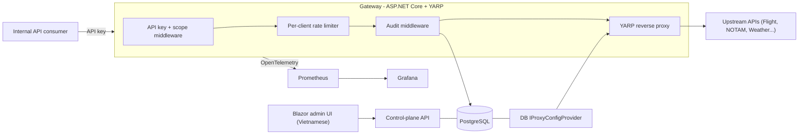

# YARP API Gateway with Vietnamese Admin Portal

## Goal

Extend the existing YARP starter ([MyProxy/Program.cs](MyProxy/Program.cs), currently config-only) into a full internal API gateway matching the mockup: dynamic routing, client/scope management, per-client rate limits, audit log, and monitoring, all driven from a database and managed via a Vietnamese-language admin UI. On-prem, internal consumers only.

## Decision recap (from prior discussion)

- Engine: keep **YARP** (best fit given on-prem + everything-in-Vietnamese + internal consumers).
- Off-the-shelf gateways (Kong/Tyk/APISIX) rejected: English-only admin UIs and external dev portals add no value here.

## Architecture

## Proposed stack

- **.NET 10** (matches existing `net10.0` in [MyProxy/MyProxy.csproj](MyProxy/MyProxy.csproj)).
- **EF Core + PostgreSQL** for clients, scopes, rate limits, routes, audit log.
- **ASP.NET Core built-in rate limiter** (partitioned per client).
- **Serilog** for structured audit + app logging.
- **OpenTelemetry + Prometheus + Grafana** for the monitoring dashboard (screen 3).
- **Blazor Server** for the Vietnamese admin UI (stays in one .NET solution; `IStringLocalizer` resource files for vi-VN).
- **xUnit** test project (TDD for backend/domain logic per your workflow; UI screens exempt).

## Solution layout (target)

- `MyProxy/` - gateway host (proxy + middleware pipeline).
- `MyProxy.Domain/` - entities + business logic (Client, Scope, RateLimit, Route, AuditEntry).
- `MyProxy.Infrastructure/` - EF Core DbContext, repositories, dynamic `IProxyConfigProvider`.
- `MyProxy.Admin/` - Blazor Server admin UI (Vietnamese).
- `MyProxy.Tests/` - xUnit tests.

## Phases

### Phase 1 - Solution + data foundations (TDD)

- Restructure into the multi-project solution above; add  + Npgsql + xUnit.
- Define domain entities and `GatewayDbContext`; create initial migration.
- Tests first for domain rules (scope parsing, rate-limit validation).

### Phase 2 - Dynamic YARP config from DB

- Implement custom `IProxyConfigProvider` loading routes/clusters from the DB, with runtime reload (replaces static `ReverseProxy` section in [MyProxy/appsettings.json](MyProxy/appsettings.json)).
- Tests for config mapping (DB rows -> `RouteConfig`/`ClusterConfig`) and reload signaling.

### Phase 3 - Auth + scopes (TDD)

- API-key authentication middleware resolving the calling client.
- Scope authorization (`read:flights`, `write:flights`, etc.) matched against route requirements.
- Tests for valid/invalid/expired keys and scope allow/deny.

### Phase 4 - Per-client rate limiting (TDD)

- Partitioned rate limiter keyed by client, limits sourced from DB (the `req/min` column in mockup screen 2).
- Tests for limit enforcement and 429 behavior.

### Phase 5 - Audit logging (TDD)

- Middleware capturing timestamp, client, IP, method, endpoint, status, latency -> DB (mockup screen 4).
- Tests asserting an audit entry per request with correct fields.

### Phase 6 - Control-plane API + Vietnamese admin UI

- REST endpoints for client/scope/rate-limit/route CRUD (TDD on the API layer).
- Blazor Server admin UI in Vietnamese: client management (screen 2), audit log viewer (screen 4), overview/docs page (screen 1). UI screens themselves not TDD'd.

### Phase 7 - Monitoring dashboard

- Wire OpenTelemetry metrics from the gateway; expose Prometheus scrape endpoint; provision a Grafana dashboard (screen 3). Optionally embed/iframe into the admin UI, or build a custom Vietnamese dashboard from DB aggregates if pixel-control is required.

## Out of scope / assumptions

- No external self-service developer portal (consumers are internal).
- Swagger/Postman doc hosting (screen 1) treated as static links initially.
- Decisions to confirm during Phase 1: PostgreSQL vs SQL Server; Blazor Server vs a separate React/Vue SPA; Grafana embed vs fully custom Vietnamese monitoring UI.

